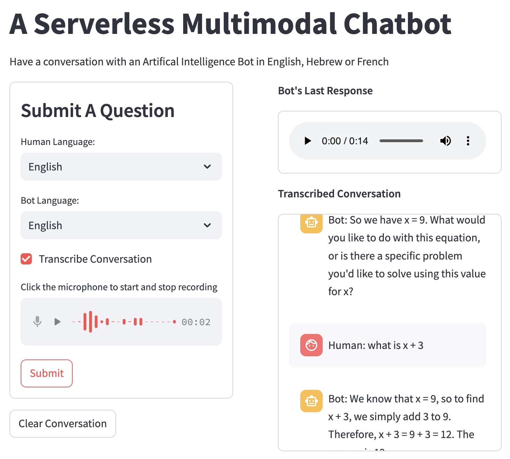

# Building & Deploying A Serverless Multimodal ChatBot 
------------------------------------------------------

In this blog post I will go over how to create a create multimodal chatbot using a [Large Language Model (LLM)](https://en.wikipedia.org/wiki/Large_language_model). Specifically, I'll build an app that you can speak to and get an audio reply. The app will also optionally transcribe conversation. I will go over how to do this all in a serverless framework and using cloud-based APIs so that (baring the app getting really popular) the costs will be next to nothing! 

### Part 1
------------
In part 1 I'll go over building the app and running it locally by using [LangChain](https://www.langchain.com/) & [Groq API](https://groq.com/) to interact with the [Llama 3](https://ai.meta.com/blog/meta-llama-3/) Open Source LLM. I'll use the Google Cloud API for [Text-To-Speech](https://cloud.google.com/text-to-speech?hl=en) and [Speech-To-Text](https://cloud.google.com/speech-to-text/?hl=en) and for the front end and deployment I'll use [Streamlit](https://streamlit.io/).

### Part 2
------------
In Part 2, I'll cover how to deploy this app using [Docker](https://www.docker.com/) for containerization which will allow us to run the app both locally and on the cloud. Then well cover [GitHub Actions](https://github.com/features/actions) for automatically building the image and pushing it to [Docker Hub](https://hub.docker.com/) where it can be pulled and run on [Google Cloud Run](https://cloud.google.com/run) to create a serverless application.

### Running The App Locally
--------------------------------------
To run the app locally you'll have to get API keys for Groq and Google API.

You can then build and run the app with Docker,

    docker image build -t <image_name> .

    docker run -ip 8080:8080 -e GROQ_API_KEY=<your-groq-api> -e GOOGLE_API_KEY=<your-google-api>

Or using placing your api keys in as defined above in a file labeled `.env` and use [Docker Compose](https://docs.docker.com/compose/),

    docker compose up 

You can the visit the website in your browser, https://localhost:8080 and it will look like the below,

